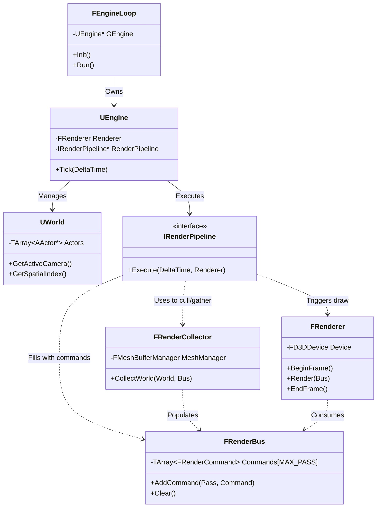
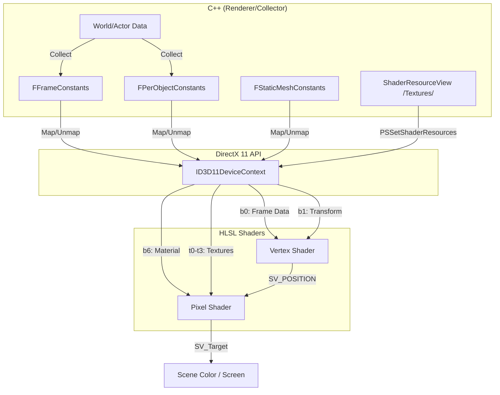

# NipsEngine Architecture Overview

This document provides a high-level architectural overview of the NipsEngine, a DirectX 11-based 3D engine.

---

## 1. Directory Tree

```text
NipsEngine/
├── Shaders/                        # HLSL Shader Source Files
│   ├── Common.hlsl                 # Shared structs and functions
│   ├── ShaderStaticMesh.hlsl       # PBR-lite Static Mesh shader
│   ├── Primitive.hlsl              # Basic colored primitive shader
│   ├── Gizmo.hlsl                  # Editor gizmo (translation/rotation) shader
│   ├── OutlinePostProcess.hlsl     # Selection outline effect
│   └── ...                         # (HiZ, Occlusion, UI Shaders)
└── Source/
    ├── Editor/                     # Editor-specific functionality
    │   ├── Selection/              # Actor selection & Gizmo logic
    │   ├── UI/                     # ImGui widgets (Properties, Console, Outliner)
    │   └── Viewport/               # Multi-viewport layout & Navigation
    ├── Engine/
    │   ├── Asset/                  # Resource loaders (OBJ, Textures, Fonts)
    │   ├── Component/              # Actor Components (Mesh, Camera, Gizmo)
    │   ├── Core/                   # Math, Containers, Input, Platform abstraction
    │   ├── GameFramework/          # World, Actor, Level management
    │   ├── Object/                 # Custom UObject system & RTTI
    │   ├── Render/                 # Core Rendering Logic
    │   │   ├── Device/             # D3D11 Device & Resource management
    │   │   ├── Renderer/           # Renderer & Render Pipelines
    │   │   └── Scene/              # Command collection (RenderBus/Collector)
    │   ├── Runtime/                # Engine Loop & Application entry
    │   └── Spatial/                # BVH & KD-Tree implementation
    └── Misc/                       # Tools (ObjViewer standalone mode)
```

---

## 2. Rendering Class Interactions (Mermaid)

The following diagram illustrates how the core engine classes interact to produce a frame.



---

## 3. HLSL Shader & C++ Renderer Data Flow

Data flows from the CPU (C++) to the GPU (HLSL) primarily through **Constant Buffers** and **Shader Resource Views (SRVs)**.



---

## 4. Module Table

| Module | Role | Key Files |
| :--- | :--- | :--- |
| **Object System** | Custom RTTI, casting, and object lifecycle management. | `Object.h`, `Object.cpp` |
| **Core** | Essential math types, platform time, and string utilities. | `Vector.h`, `Matrix.h`, `PlatformTime.cpp` |
| **Game Framework** | High-level world, level, and actor abstractions. | `World.cpp`, `AActor.cpp`, `Level.cpp` |
| **Render Device** | Low-level D3D11 device/context and resource wrapping. | `D3DDevice.cpp`, `Buffer.h`, `Shader.cpp` |
| **Scene Pipeline** | Command-based rendering flow (Collect -> Bus -> Draw). | `RenderCollector.cpp`, `RenderBus.cpp` |
| **Renderer** | State management, pass execution, and batching logic. | `Renderer.cpp`, `DefaultRenderPipeline.cpp` |
| **Spatial** | Fast visibility queries via BVH and KD-Tree. | `BVH.cpp`, `WorldSpatialIndex.cpp` |
| **Editor** | Multi-viewport tools, gizmos, and ImGui integration. | `EditorEngine.cpp`, `EditorRenderPipeline.cpp` |
| **Asset** | File parsing and GPU resource creation from disk. | `ObjLoader.cpp`, `ParticleAtlasLoader.cpp` |
