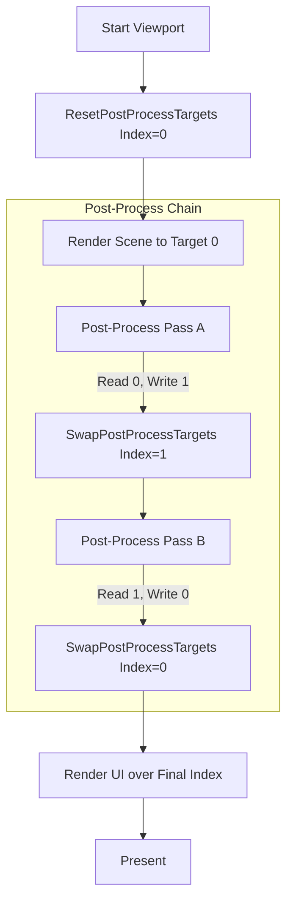

# NipsEngine: RenderViewport Flow Analysis

This document explains the technical sequence within `FEditorRenderPipeline::RenderViewport` and identifies the critical hooks for extending the post-processing pipeline using the engine's built-in **Ping-Pong** infrastructure.

---

## 1. High-Level Lifecycle: Collect-Prepare-Execute

The rendering flow follows a strict sequence to decouple scene logic from GPU state management.

### A. Viewport Setup
1.  **`BuildSceneView`**: Calculates camera matrices and the `ViewRect` sub-region.
2.  **`SetSubViewport`**: Restricts rasterization to the defined viewport area.
3.  **`ResetPostProcessTargets()`**: (CRITICAL) Resets the `ActiveViewportColorIndex` to `0` at the start of the viewport's frame.

### B. The Collection Stage (CPU)
*   **`Bus.Clear()`**: Resets the per-frame command bucket.
*   **`Collector.CollectWorld(...)`**: Generates commands for `Opaque` and `Translucent` passes.
*   **`Collector.CollectSelection(...)`**: Injects `SelectionMask` and `PostProcessOutline` commands.

### C. The Batching Stage (`Renderer.PrepareBatchers(Bus)`)
*   Copies dynamic primitive data (Lines, Text, Particles) to GPU buffers.
*   Standard post-processes typically skip this, as they use `SV_VertexID` in the shader.

### D. The Execution Stage (`Renderer.Render(Bus)`)
1.  **Initial Scene Rendering**: The scene is rendered to the initial target (index 0).
2.  **Post-Process Pass Loop**: When a post-process pass is encountered:
    *   The renderer utilizes the `FD3DDevice` ping-pong helpers.

---

## 2. Using the Built-in Ping-Pong Infrastructure

The `FD3DDevice` already contains a dual-buffer system (`ViewportColorTargets[2]`) designed for sequential effects.

### Key API Functions (`FD3DDevice`)
| Function | Role |
| :--- | :--- |
| `GetPostProcessSourceSRV()` | Returns the SRV of the **currently active** color target. |
| `GetPostProcessDestRTV()` | Returns the RTV of the **inactive** color target (the "next" target). |
| `SwapPostProcessTargets()` | Swaps the `ActiveViewportColorIndex` (0 $\leftrightarrow$ 1). |
| `ResetPostProcessTargets()` | Sets the index to 0, ensuring we start from the base scene buffer. |
| `GetFinalColorSRV()` | Returns the SRV of the **most recent** result after all swaps. |

### Implementation Pattern for Multi-Pass Effects
To implement a multi-pass effect (e.g., Blur), follow this pattern in `FRenderer::Render`:

```cpp
void FRenderer::ExecuteMultiPassEffect(ID3D11DeviceContext* Context)
{
    // 1. Get the current source and the 'other' buffer as destination
    ID3D11ShaderResourceView* Source = Device.GetPostProcessSourceSRV();
    ID3D11RenderTargetView* Dest = Device.GetPostProcessDestRTV();

    // 2. Bind resources
    Context->OMSetRenderTargets(1, &Dest, nullptr);
    Context->PSSetShaderResources(0, 1, &Source);

    // 3. Draw the pass
    DrawFullscreenTriangle(Context);

    // 4. Swap the index so the 'Dest' becomes the new 'Source'
    Device.SwapPostProcessTargets();
    
    // 5. Unbind the source to prevent read/write conflicts in the next pass
    ID3D11ShaderResourceView* nullSRV = nullptr;
    Context->PSSetShaderResources(0, 1, &nullSRV);
}
```

---

## 3. Visual Flow Summary



## 4. Hook Checklist
- [ ] **`ERenderPass`**: Define the pass order in `RenderTypes.h`.
- [ ] **`Renderer::Render`**: Use `GetPostProcessSourceSRV()` and `GetPostProcessDestRTV()`.
- [ ] **`Renderer::Render`**: Call `SwapPostProcessTargets()` after every `Draw`.
- [ ] **`FEditorRenderPipeline`**: Ensure `ResetPostProcessTargets()` is called before viewport rendering starts.

---

## 5. Scene Depth View Implementation
The `ViewportDepthStencilSRV` (accessible via `CurrentRenderTargets.DepthStencilSRV`) is currently initialized but unused in the renderer. To visualize the scene depth:

1.  **Define Pass**: Add `ERenderPass::DepthView` to `RenderTypes.h`.
2.  **Bind Resource**: In `FRenderer::Render`, when the pass is `DepthView`, bind the depth SRV:
    ```cpp
    ID3D11ShaderResourceView* DepthSRV = CurrentRenderTargets.DepthStencilSRV;
    Context->PSSetShaderResources(0, 1, &DepthSRV);
    ```
3.  **Visualization Shader**: The depth value in the `R24_UNORM` channel is non-linear. Use a shader to linearize it:
    ```hlsl
    // Simple linearization (approximation)
    float d = DepthTexture.Load(int3(pixelCoord, 0)).r;
    float linearD = (2.0 * Near) / (Far + Near - d * (Far - Near));
    return float4(linearD.xxx, 1.0);
    ```

