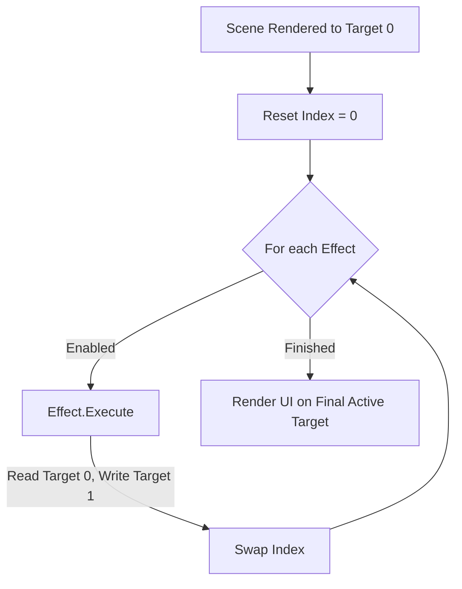

# Post-Process Ping-Pong Refactoring Plan

This document outlines the strategy for refactoring the NipsEngine rendering pipeline to support a modular, multi-pass post-processing system using the existing ping-pong infrastructure in `FD3DDevice`.

---

## 1. Objective
Currently, post-processing (like the Selection Outline) is hardcoded into the main `FRenderer::Render` loop and performed "in-place" on a single render target. This refactoring will:
- **Modularize**: Move effect-specific logic into independent classes.
- **Sequentialize**: Allow multiple effects (Outline, FXAA, Blur) to run in a chain.
- **Standardize**: Utilize the `FD3DDevice` ping-pong targets (`ViewportColorTargets[2]`) correctly.

---

## 2. Core Interface: `IPostProcess`

All post-process effects must implement the `IPostProcess` interface defined in `PostProcessBase.h`.

```cpp
class IPostProcess {
public:
    virtual ~IPostProcess() = default;
    virtual void Create(ID3D11Device* Device, FRenderResources& Resources) = 0;
    virtual void Release() = 0;
    virtual bool IsEnabled(const FRenderBus& Bus) const = 0;
    virtual void Execute(
        ID3D11DeviceContext*    Context,
        const FRenderBus&       Bus,
        const FRenderTargetSet& RenderTargets,
        ID3D11ShaderResourceView* SceneColorSRV, // Current Source
        ID3D11RenderTargetView*   OutputRTV      // Next Destination
    ) = 0;
};
```

---

## 3. Architecture Overview

### FRenderer Changes
The `FRenderer` will maintain a `PostProcessStack` (a vector of `IPostProcess` pointers).

```cpp
// Added to FRenderer.h
TArray<std::unique_ptr<IPostProcess>> PostProcessStack;
void ExecutePostProcessStack(ID3D11DeviceContext* Context, const FRenderBus& Bus);
```

### Execution Flow (The Ping-Pong Loop)
The `FRenderer` will manage the buffer swapping between passes.



---

## 4. Implementation Phases

### Phase 1: Infrastructure
- Define `IPostProcess` in `PostProcessBase.h`.
- Add the `PostProcessStack` to `FRenderer`.
- Update `FRenderer::Create` and `FRenderer::Release` to handle the stack lifecycle.

### Phase 2: Modularizing Existing Effects
- **`FPostProcessOutline`**:
    - Extract logic from `DrawPostProcessOutline`.
    - `IsEnabled` returns true if `ERenderPass::PostProcessOutline` commands exist in the `Bus`.
- **`FPostProcessFXAA`**:
    - Utilize the existing `FxaaShader` and `FxaaConstantBuffer`.
    - Implement the full shader pass (currently just a stub).

### Phase 3: Renderer Integration
- Remove hardcoded calls to `DrawPostProcessOutline` in `FRenderer::Render`.
- Implement `ExecutePostProcessStack` after the `ERenderPass` loop.
- Use `Device.GetPostProcessSourceSRV()` and `Device.GetPostProcessDestRTV()` to feed the `Execute` method.
- Call `Device.SwapPostProcessTargets()` after each effect execution.

---

## 5. Hook Checklist
- [ ] **`ERenderPass`**: Ensure all post-process enum entries are grouped at the end.
- [ ] **`D3DDevice`**: Verify `SwapPostProcessTargets` correctly toggles the `ActiveViewportColorIndex`.
- [ ] **`FEditorRenderPipeline`**: Ensure `ResetPostProcessTargets` is called at the start of every viewport frame.
- [ ] **Resource Safety**: Unbind SRVs between passes to avoid DX11 Read/Write conflicts.
