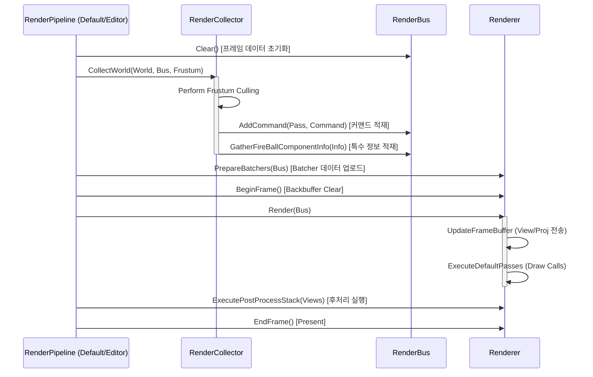

# NipsEngine 렌더링 시스템 구조 및 흐름 (Render Flow)

이 문서는 NipsEngine의 핵심 렌더링 컴포넌트인 `RenderCollector`, `RenderBus`, `Renderer`의 관계와 데이터 흐름을 설명합니다.

---

## 1. 주요 컴포넌트의 역할

### **RenderCollector (The Gatherer)**
*   **역할**: 씬의 월드(World) 정보를 렌더링 가능한 명령(`RenderCommand`)과 정보들로 변환합니다.
*   **핵심 기능**:
    *   **Culling**: `FFrustum`을 기반으로 가시성 테스트를 수행하여 불필요한 객체를 제외합니다.
    *   **Command Generation**: 각 `Actor`와 `Component`를 순회하며 적절한 `ERenderPass`에 맞는 `FRenderCommand`를 생성합니다.
    *   **Special Info Gathering**: `FireBall`, `Fog`와 같은 특수 컴포넌트 정보를 수집하여 `RenderBus`에 저장합니다.
*   **데이터 소스**: `UWorld`, `AActor`, `UPrimitiveComponent`.

### **RenderBus (The Data Carrier)**
*   **역할**: `RenderCollector`가 수집한 데이터를 `Renderer`로 전달하는 중간 매개체(Command Buffer)입니다.
*   **핵심 기능**:
    *   **Pass Queues**: 각 패스별(`ERenderPass`)로 정렬된 `FRenderCommand` 리스트를 보유합니다.
    *   **Scene State**: 카메라 행렬(View/Proj), ViewMode, ShowFlags 등을 보관합니다.
    *   **Frame Data Storage**: `FireBallInfoArray`, `HeightFogInfo` 등 프레임별 특수 데이터를 저장합니다.
    *   **Decoupling**: 상위 씬 로직과 하위 렌더링 엔진(D3D11) 간의 결합도를 낮춥니다.

### **FRenderer (The Executor)**
*   **역할**: `RenderBus`에 담긴 명령을 실제로 GPU 명령으로 변환하여 화면에 출력합니다.
*   **핵심 기능**:
    *   **Device Management**: `FD3DDevice`를 통해 D3D11 리소스를 관리합니다.
    *   **State Management**: 각 패스별 렌더 상태(DepthStencil, Blend, Rasterizer)를 설정합니다.
    *   **Drawing**: `Batcher`들을 사용하여 효율적인 드로우 콜을 실행하거나, 수집된 커맨드를 순차적으로 그립니다.
    *   **Post Processing**: 수집된 뷰 정보와 특수 정보를 바탕으로 후처리 스택을 실행합니다.

---

## 2. 렌더링 시퀀스 (Render Sequence)

전형적인 한 프레임의 흐름은 다음과 같습니다:

---

## 3. 컴포넌트 간의 상호작용 요약

| 단계 | 주체 | 동작 | 결과물 |
| :--- | :--- | :--- | :--- |
| **준비 (Prepare)** | `RenderBus` | `Clear()` 호출 | 빈 커맨드 큐 및 데이터 배열 |
| **수집 (Gather)** | `RenderCollector` | `UWorld` 순회 및 컬링 | `RenderBus` 내부에 커맨드와 씬 데이터 충전 |
| **전송 (Transfer)** | `Renderer` | `PrepareBatchers()` | CPU 데이터를 GPU Buffer로 업로드 |
| **실행 (Execute)** | `Renderer` | `Render()`, `PostProcess()` | 최종 이미지 렌더링 |
| **종료 (Finalize)** | `Renderer` | `EndFrame()` | 화면 출력 (Swap Chain Present) |

---

## 4. 핵심 관계 정리

*   **Collector → Bus**: 수집가는 버스에 짐(Command)을 싣습니다.
*   **Bus → Renderer**: 버스는 렌더러에게 전달되어 짐을 하차(Execute)합니다.
*   **Pipeline**: 이 모든 과정을 제어하고 순서를 관리하는 감독 역할을 합니다.

프레임의 마지막이나 시작 부분에 `RenderBus::Clear()`를 호출함으로써, 이전 프레임의 데이터가 남지 않도록 보장하는 것이 중요합니다. (최근 `ClearFireBallInfoArrayClear()` 호출이 `Clear()` 내부에 추가되었습니다.)
